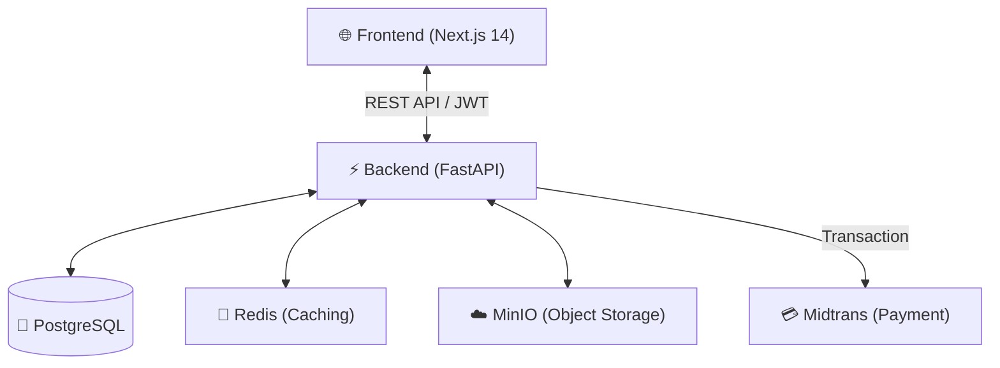

# 🏠 PERABOX - Premium Homecare Platform

[](https://nextjs.org/)
[](https://fastapi.tiangolo.com/)
[](https://www.postgresql.org/)
[](https://opensource.org/licenses/MIT)

Perabox is a comprehensive, premium homecare platform designed to connect homeowners with verified professional technicians. Built with a modern tech stack, it provides seamless booking flows, real-time tracking, and secure payment integrations.

## 🚀 Key Features

- **🎯 Smart Booking Flow**: 6-step intuitive process with instant technician assignment.
- **🛡️ Verified Technicians**: Curated profiles with ratings, specialties, and transparent pricing.
- **💬 Real-time AI Assistant**: Integrated chatbot powered by advanced LLMs for instant support.
- **💳 Integrated Payments**: Seamless QRIS integration via Midtrans for secure transactions.
- **📱 Responsive Design**: Premium, "mobile-first" approach with glassmorphic aesthetics.
- **🔒 Advanced Security**: JWT-based authentication with role-based access control (RBAC).

## 🏗️ System Architecture



## 🛠️ Tech Stack

### Frontend
- **Framework**: Next.js 14 (App Router)
- **Styling**: Tailwind CSS, Framer Motion (Animations)
- **State Management**: React Hooks, Context API
- **Verification**: Zod, React Hook Form

### Backend
- **Framework**: FastAPI (Python 3.11)
- **ORM**: SQLAlchemy / Alembic
- **Security**: OAuth2 with JWT, Passlib (Bcrypt)
- **Infrastructure**: Redis, MinIO

## 📂 Project Structure

```text
perabox/
├── backend/            # FastAPI Application
│   ├── app/           # Core Logic
│   └── alembic/       # DB Migrations
├── frontend/           # Next.js Application
│   ├── src/app/       # Routes & Layouts
│   └── src/components/# UI Components
├── database/           # PostgreSQL Configurations
└── docs/               # Technical Documentation
```

## 🛠️ Development Setup

### Prerequisites
- Docker & Docker Compose
- Node.js 18+
- Python 3.11+

### Quick Start (Docker)
```bash
docker-compose up --build
├── frontend/          # Next.js application
├── backend/           # FastAPI application
├── database/          # SQL migrations and seeds
├── docs/              # Documentation
├── .github/           # CI/CD workflows
└── docker-compose.yml # Docker orchestration
```

## 🛠 Tech Stack

- **Frontend**: Next.js 14, React 18, TypeScript
- **Backend**: FastAPI, Python 3.11
- **Database**: PostgreSQL 15
- **Cache**: Redis 7
- **Storage**: MinIO (S3-compatible)
- **Auth**: JWT (access + refresh tokens)

## 📚 Documentation

- [API Documentation](http://localhost:8000/docs) - OpenAPI/Swagger UI
- [Deployment Guide](DEPLOYMENT.md) - Production deployment
- [Security](SECURITY.md) - Security best practices

## 🔧 Development

### Frontend Development

```bash
cd frontend
npm install
npm run dev
```

### Backend Development

```bash
cd backend
pip install -r requirements.txt
uvicorn app.main:app --reload
```

### Running Tests

```bash
# Backend tests
cd backend
pytest

# Frontend tests
cd frontend
npm test
```

## 🌟 Features

- ✅ User authentication (JWT)
- ✅ Service catalog with categories
- ✅ Booking management
- ✅ Technician assignment
- ✅ Payment integration (mocked)
- ✅ Rating and reviews
- ✅ Articles and testimonials
- ✅ Modern UI/UX design (beige/cream theme)

## 📝 License

Copyright © 2026 PERABOX. All rights reserved.

## 📞 Support

For support, email support@perabox.com or create an issue in the repository.
